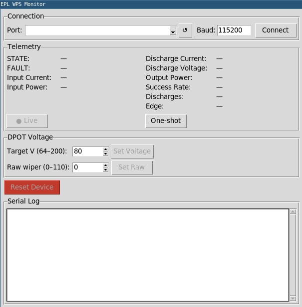

# Utilities for the WPS
Here is a place for tools and services built around the Wire Power Supply.

## wps-monitor.py

This is a GUI for controlling viewing the Wire Power Supply. It includes a serial monitor and controls for setting the output voltage, resetting the device, and connecting to the device. 

> This has been developed in part using Claude 4.6
